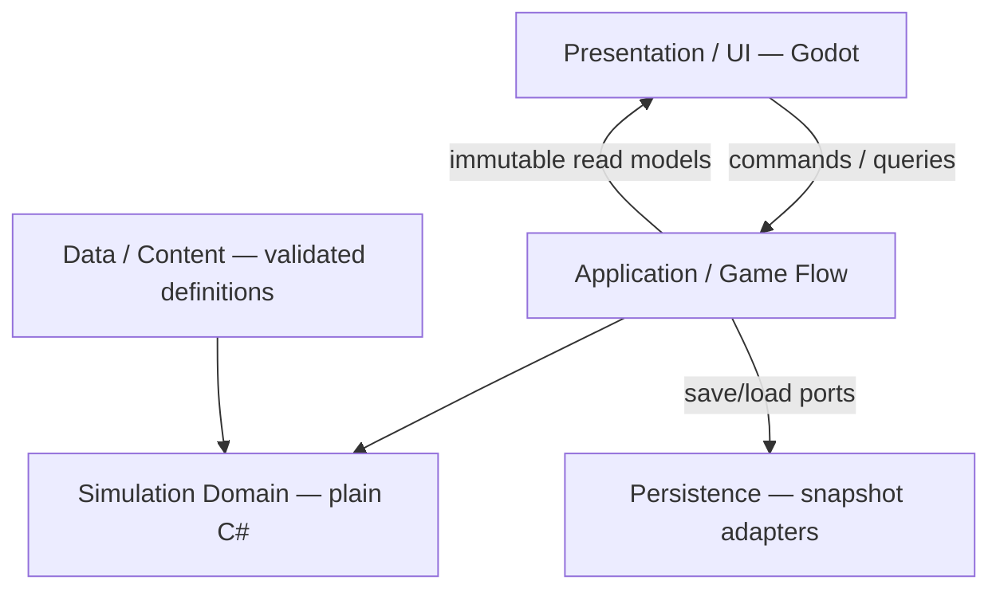

# Production Architecture — ADR-TF-002

Status: PROPOSED. Date: 2026-10-04. Owner: Technical Lead.
Approval owner: Project Director.

## Context and authority

**DECISION:** DEC-009/010/012/014/015/017 establish daily chronology, two authoritative roots, stored-vs-derived discipline, bounded delegation/rivals and outcome boundaries.

**FACT:** Python demonstrated these properties under bounded fixtures. Its module layout is not the production template.

## Proposed architecture

**PROPOSAL:** A desktop modular monolith with a plain C# simulation core and one writer per campaign. The following responsibility layers do not imply that the domain depends on filesystem adapters.

| Layer | Owns responsibility | Dependency rule |
| --- | --- | --- |
| Presentation | Screens, panels, input, view models, formatting | References Application contracts, not mutable domain aggregates |
| Application | Session lifecycle, command dispatch, advancement, projection, save/load coordination | References Domain and defines I/O ports |
| Simulation Domain | Company/World facts, legal transitions, pure resolvers, outcomes | No engine, filesystem, wall clock, service locator or global RNG |
| Data / Content | Immutable definitions and validation | Infrastructure loads definitions; Domain consumes typed immutable values |
| Persistence | Save DTOs, serialization, migration and file replacement | Implements Application ports; never selects gameplay results |

The composition root is the Client or Headless Runner. Infrastructure may reference Application/Domain; the core never references Infrastructure. Client construction can see the adapters, while screen code uses only application-facing interfaces.

## Execution and concurrency

**PROPOSAL:**

1. UI receives an immutable, observation-filtered read model with a revision.
2. UI or a policy submits a command to Application.
3. One simulation worker validates and stages changes.
4. Owning modules apply changes through an ordered transaction and outcome dispatch.
5. Commit state/cursor/receipts together, then publish a new projection.

Engine scene-tree changes occur only on the UI thread. No background system writes Company/World independently. A query uses a committed snapshot; it does not advance time or draw gameplay randomness.

Exceptions abort the in-progress transaction. The previous committed state remains usable; a deterministic fault record includes the failing command and phase. Do not continue from partially applied state.

Save requests and pause requests are serviced at committed boundaries. Loading creates a separate validated session, then replaces the old session atomically.

## Public interfaces (conceptual, not engine APIs)

**PROPOSAL:**

| Contract | Inputs | Result / invariant |
| --- | --- | --- |
| Query | Query type, filters, observed revision | Immutable read model; no hidden truth |
| SubmitCommand | Unique command ID, expected revision, checkpoint ID where relevant, intent | Accepted receipt or rejected reasons; duplicate ID is idempotent |
| AdvanceUntil | Target day or next meaningful checkpoint | Committed cursor and checkpoint/end condition |
| Observe | Actor ID, knowledge revision, decision context | Observation of allowed facts, estimates and confidence |
| Save | Slot, expected session identity | Last complete boundary saved, or explicit failure |
| Load | Save source | Validated replacement session, or original session retained |
| Replay | Initial snapshot, versions, seed, accepted decisions | Final hash plus earliest divergent transition |

Use typed command/result/outcome contracts, not string-based arbitrary property setters. There is one executor for manual and delegated decisions. See [ownership and boundaries](STATE_OWNERSHIP_SIMULATION_BOUNDARY.md).

## Architecture alternatives

**PROPOSAL:**

| Alternative | Trade-off | Disposition |
| --- | --- | --- |
| Gameplay in engine nodes/scenes | Convenient local editing; harder headless isolation and save ownership | Reject as domain architecture |
| Event sourcing | Full history reconstruction; migration/retention complexity | Defer; use snapshots plus diagnostic command/outcome journals |
| ECS for all data | May help specific workloads; adds model and tooling complexity | Defer until measured need |
| Services or distributed simulation | Independent deployment; unnecessary coordination and determinism burden | Exclude from initial offline product |

Future expansion uses bounded domain modules and content schemas; it does not introduce future industries, teams or generic plugin execution now.

## Consequences and reversal

**PROPOSAL:** Separate domain tests and UI tests; accept explicit mapping between state, save DTOs and read models. Mapping cost buys ownership clarity. Changing engine rewrites host/UI while retaining the domain contracts as far as runtime compatibility permits.

**OPEN QUESTION:** Engine approval and production scale remain Director/design decisions. Neither blocks reviewing the architecture boundary itself. QG-03 and T-01–T-13 in the [test strategy](TESTING_DETERMINISM_DEBUGGING.md) define future evidence.
